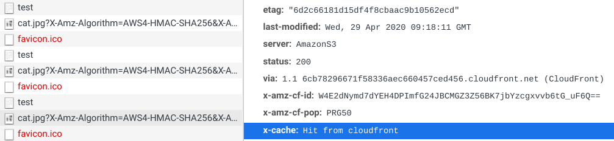

## Demo code how to use S3 Signed URLs through CloudFront with proxy caching

To learn more, see [this blog post](https://advancedweb.hu/how-to-use-s3-signed-urls-with-cloudfront/).

### How it works

It creates a Lambda function behind an API Gateway that returns a HTML with an image. The image href is a signed URL for an object stored in a private bucket. There is a CloudFront distribution that proxies requests to the bucket.

The signed URL's domain is changed to CloudFront's and the distribution translates it back to the original URL. With this setup, the image is downloaded through CloudFront but uses the signing mechanism of S3.

Caching is configured on the CloudFront distribution and the signed URLs are made cache-friendly using time rounding. See [this article](https://advancedweb.hu/cacheable-s3-signed-urls/) for more info.

The result is subsequent requests to the image comes from CloudFront's cache instead of going all the way to the bucket.



### Prerequisites

* npm
* terraform

### How to use

* ```terraform init```
* ```terraform apply```
* open the URL
* open the devtools, check "Disable cache" on the network panel, then refresh the page a few times
* ```terraform destroy```

The image is from the [https://thecatapi.com/](https://thecatapi.com/).
